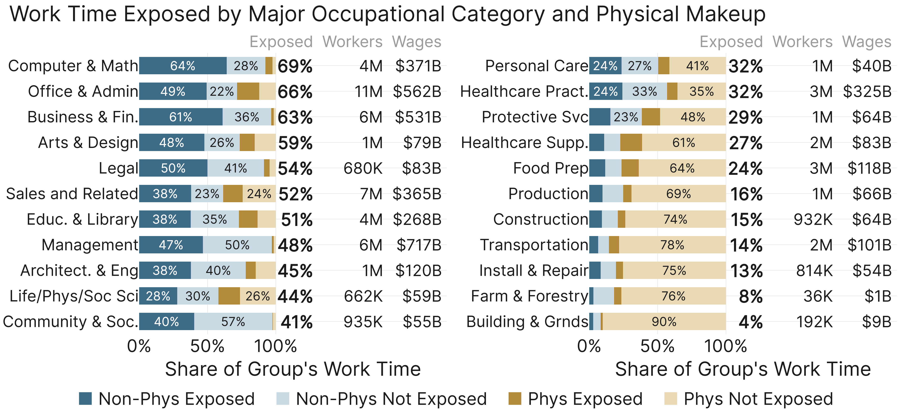
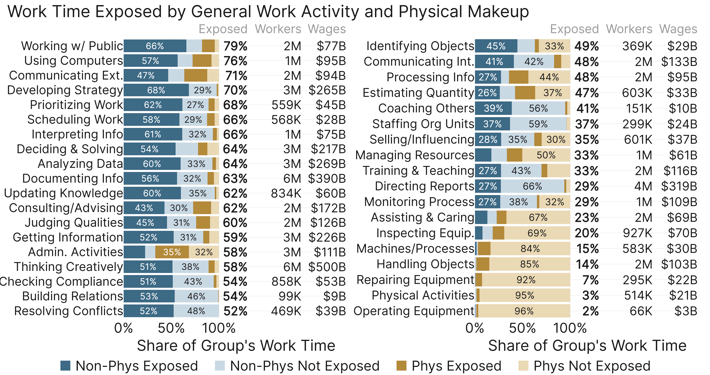
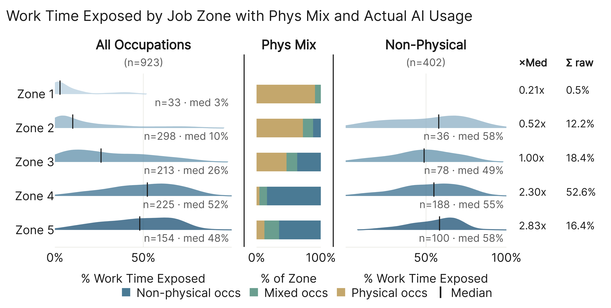
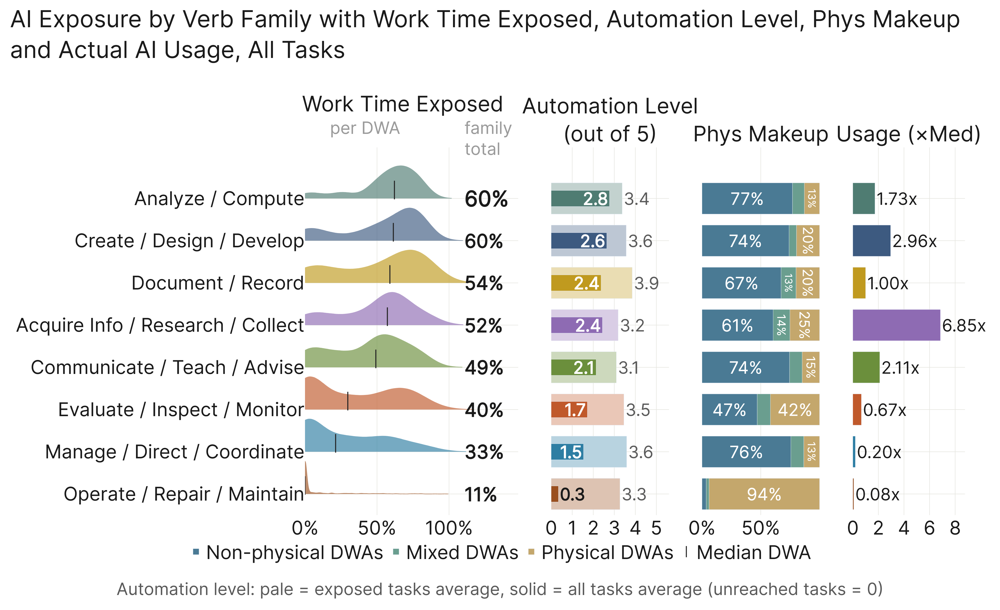
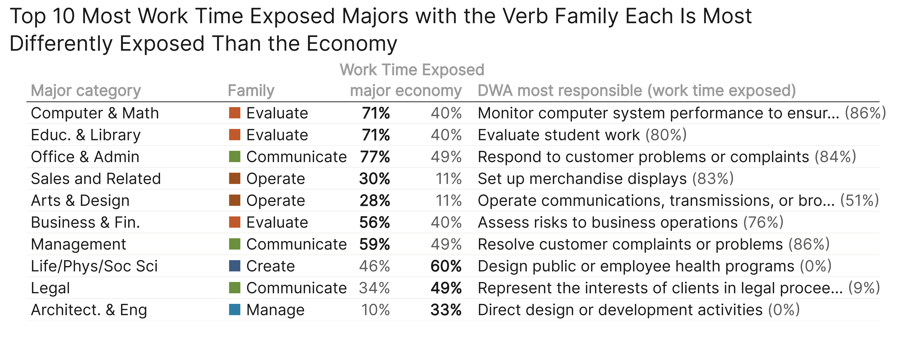
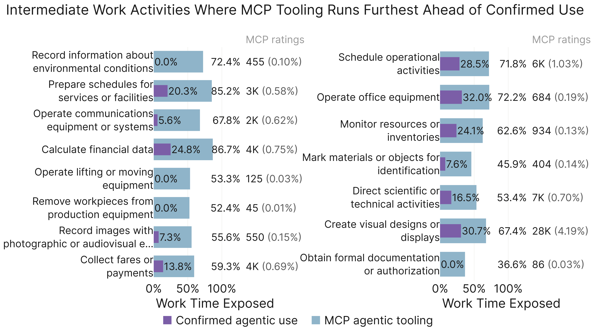
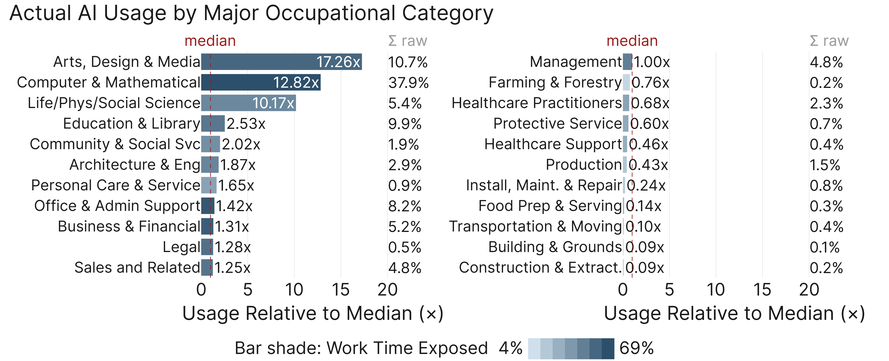
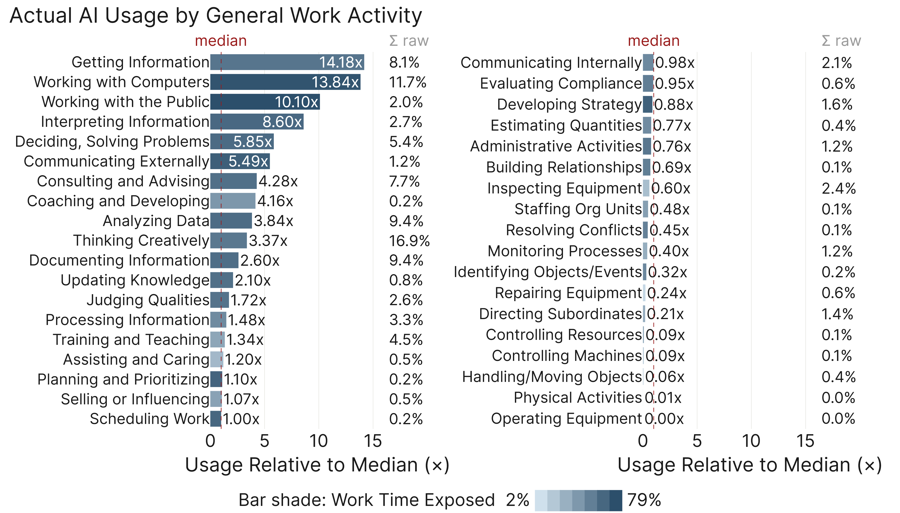
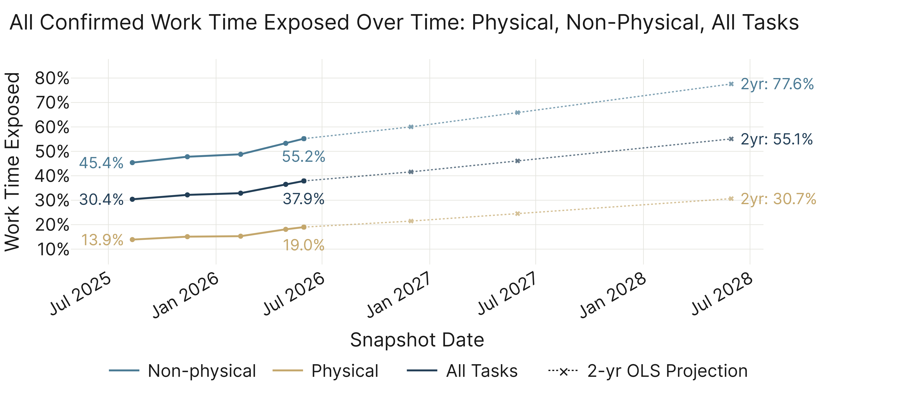
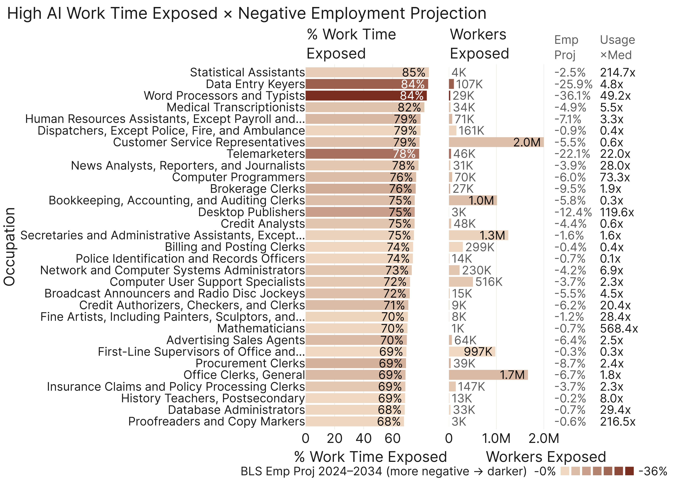

# Main-Body Figures

Every main-body figure from the paper, in Results order. Regenerate with
`python paper_figures/run_main_figures.py`.

---

## Occupational Structure

---

## Job Zones

---

## Verb Families

---

## Agentic AI

---

## Actual AI Usage

---

## Trends

---

## Focused Set

