# Supplemental Figures

Every supplementary-materials figure, in order. Regenerate with
`python paper_figures/run_supplemental_figures.py`.

---

## Verb Families, Non-Physical Tasks Only

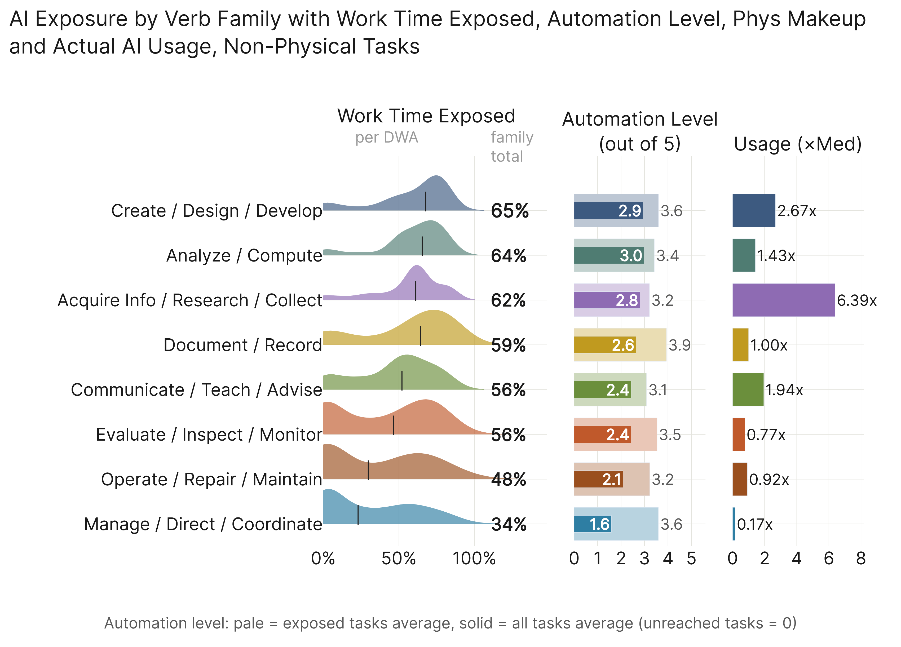

---

## Actual AI Usage Inside Three Majors

### Life, Physical & Social Science

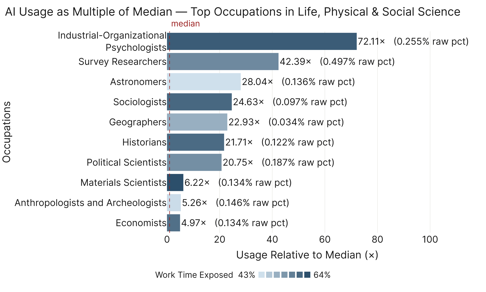

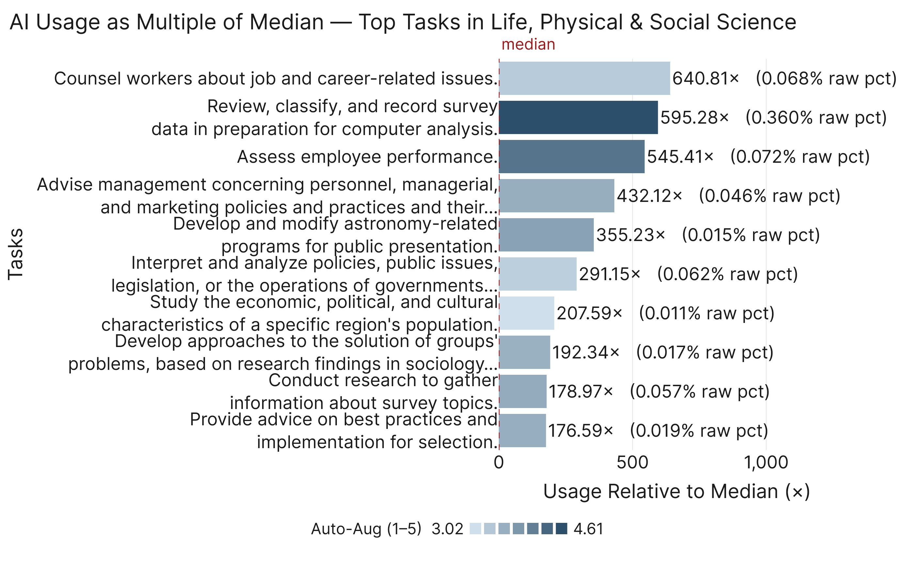

### Arts, Design & Entertainment

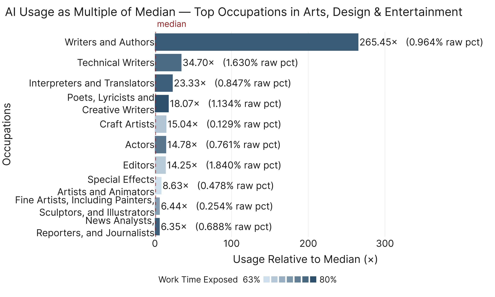

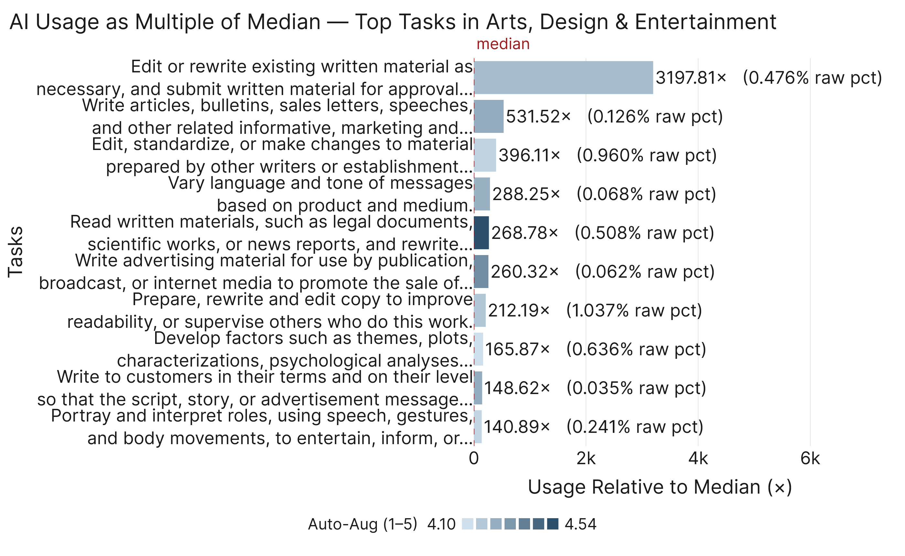

### Computer & Mathematical

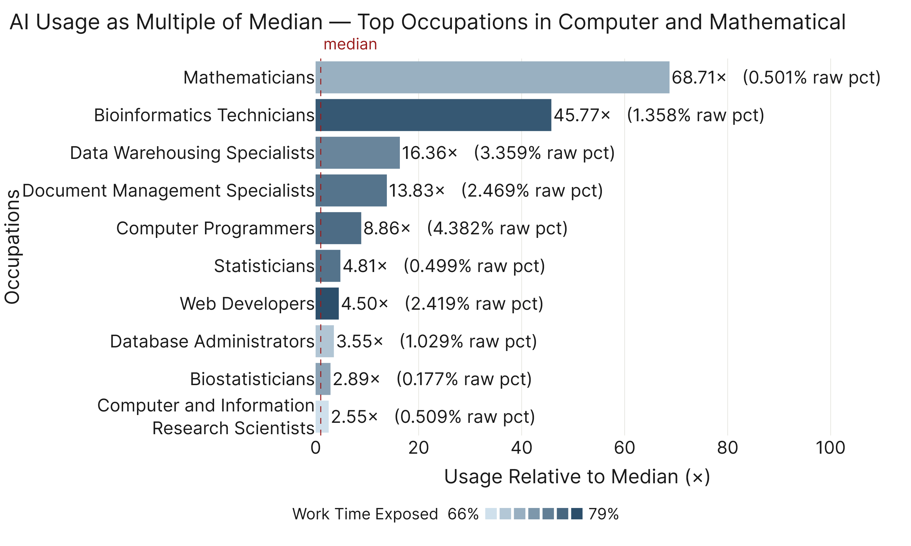

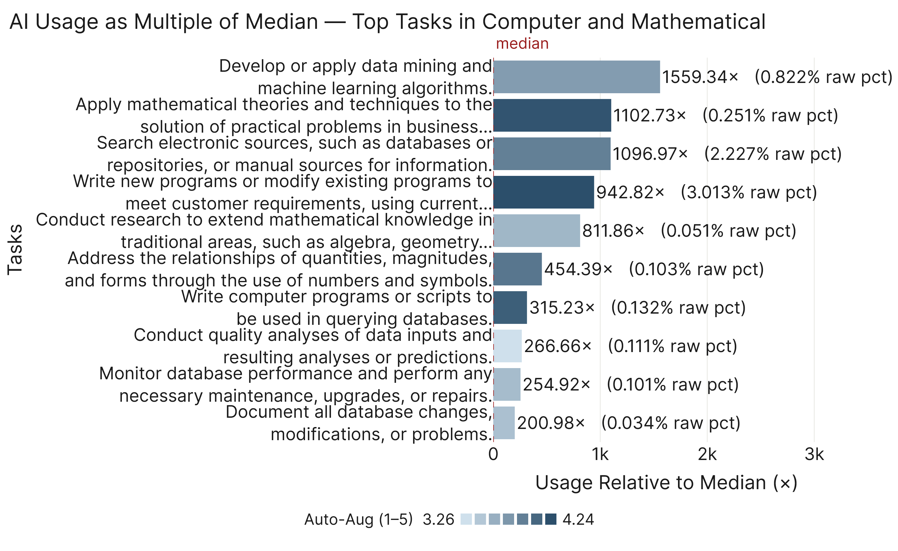

---

## Actual AI Usage Inside the Four Leading Work Activities

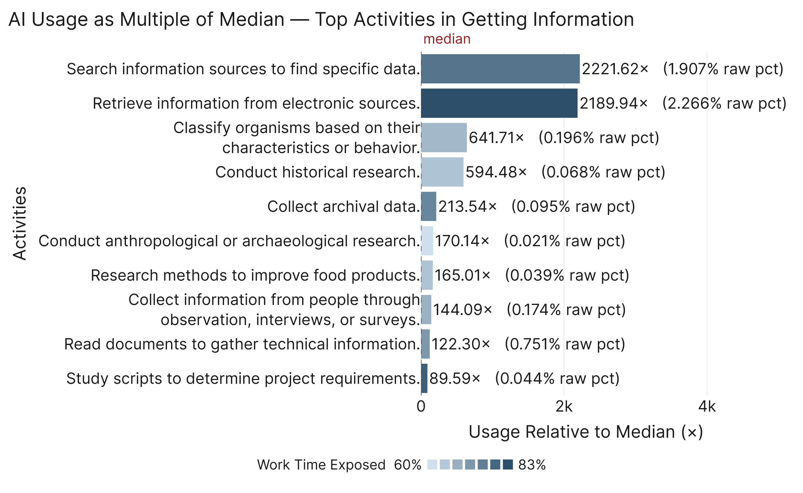

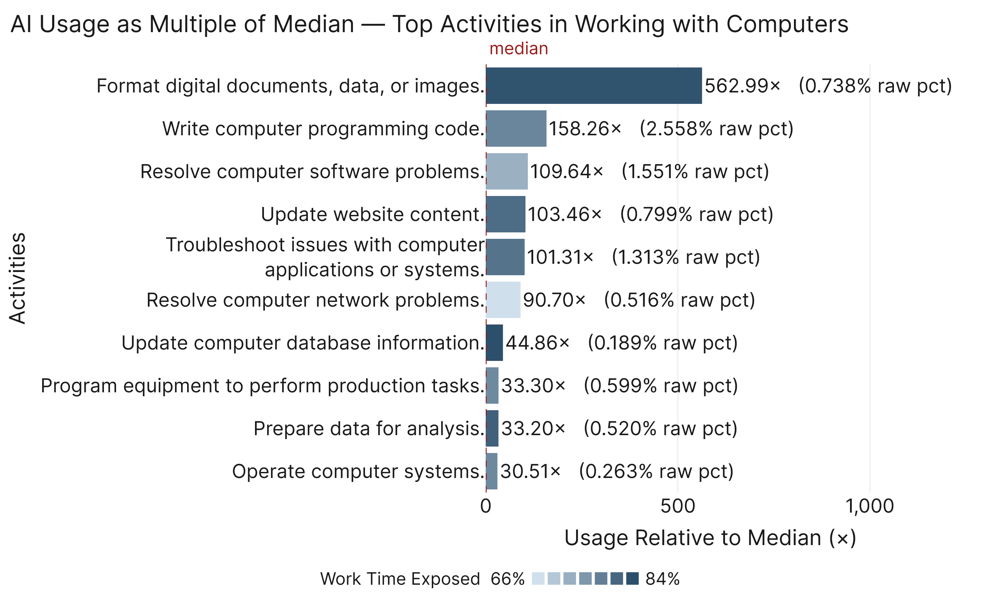

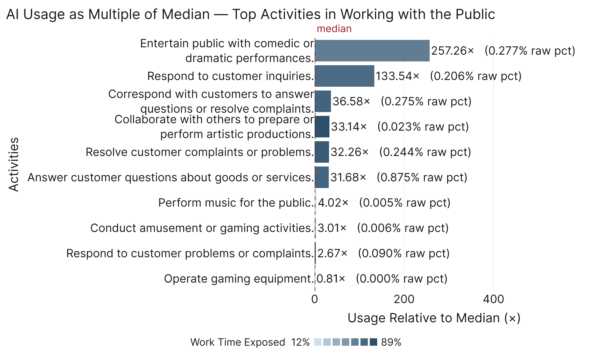

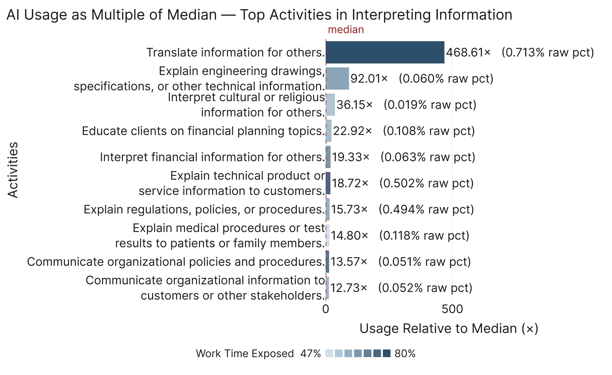

---

## Convergence Against External Benchmarks

---

## Where We and Eloundou Disagree

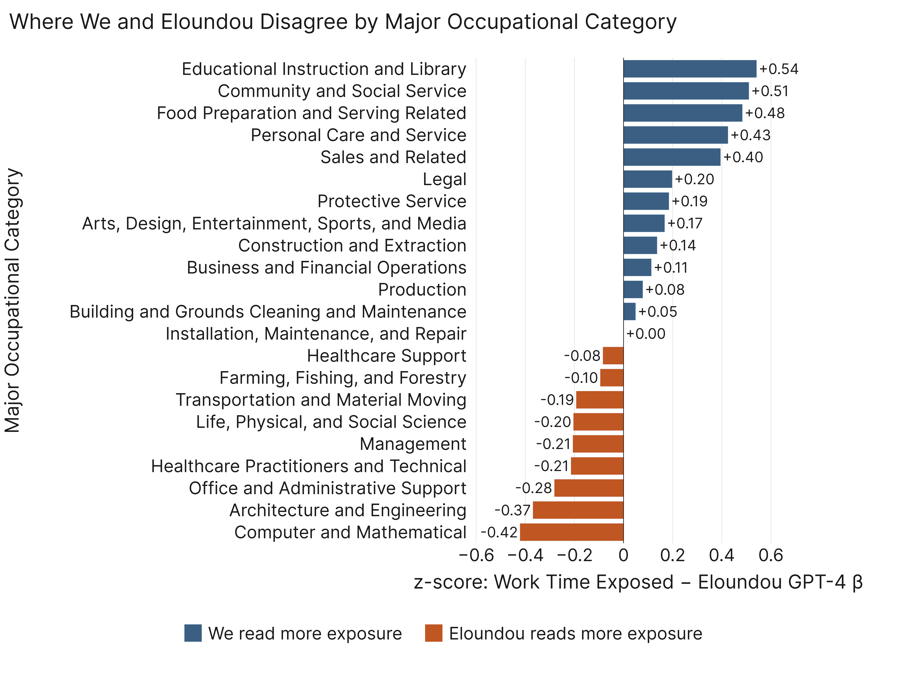
